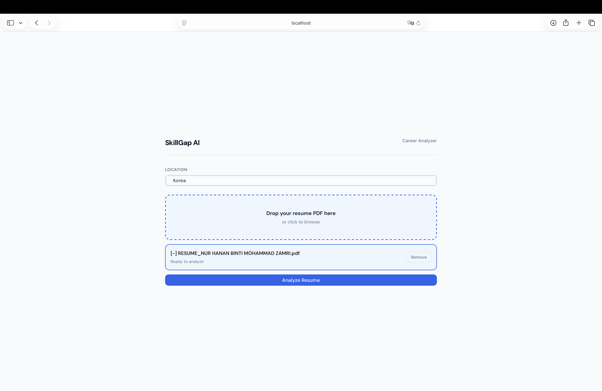
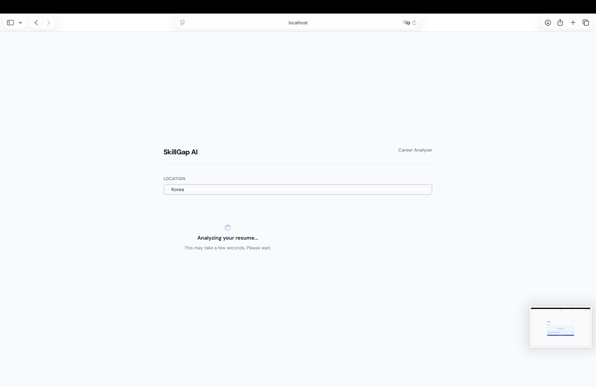
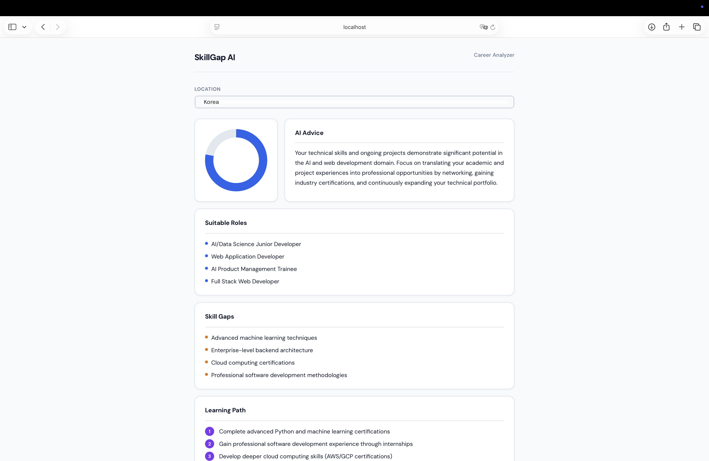

# ⚡ SkillGap AI

**Upload your resume. Get a personalized career report in seconds.**

Most job seekers don't know why they're getting rejected. They apply to dozens of roles without knowing whether they're qualified, what skills they're missing, or what to improve next.

SkillGap AI reads your actual resume PDF, not a form you filled in, and generates a real career report tailored to your skills and your city. 

---

## Why I Built This

A lot of graduates finish their degree, build a resume, and start applying — then hear nothing back. The problem is usually not that they're unqualified. It's that they're applying for the wrong roles, or missing two or three specific skills that would have made all the difference. Nobody told them.

Career counseling is expensive. University career centers are understaffed. Googling "what skills do I need" gives you a generic list that says nothing about *your* background.

SkillGap AI is built to close that gap. It reads your actual resume and gives you honest, specific, actionable advice — in the time it takes to make a cup of coffee.

---

## Features

| Feature | Description |
|---|---|
| PDF Resume Upload | Drag and drop or click to upload any text-based PDF resume |
| Suitable Roles | Job titles you are currently qualified to apply for |
| Skill Gaps | Specific missing skills that are holding you back |
| Learning Path | A numbered, step-by-step plan in the right order |
| Job Suggestions | Realistic job types tailored to your city or country |
| AI Advice | 2–3 sentences of personalized, honest career advice |
| Job Readiness Score | A score from 0–100 showing how job-ready your resume is |
| Reset & Re-analyze | One click to start over with a new resume |

---

## Demo Video

> 📹 Watch the demo to see SkillGap AI in action — from uploading a resume to receiving the full career report.


---

## Screenshots

All screenshots are stored in `assets/screenshots/`. Add your own by running the app and taking captures of each screen.

---

### 1. Upload Screen



The starting screen. Enter your city in the location field, then drag and drop your resume PDF — or click the upload zone to browse for a file.

---

### 2. Analyzing — Loading State



A spinner appears while Claude reads your resume and generates the report. This usually takes 5–10 seconds depending on your connection.

---

### 3. Job Readiness Score + AI Advice + Suitable Roles + Skill Gaps + Learning Path + Job Suggestion



The score ring fills to your readiness percentage. The other card shown the AI evaluation, work as your personal career conselor.

---

## How It Works

```
You type your city
        +
You upload your resume PDF
        ↓
PyPDF2 extracts all text from every page
        ↓
Resume text + location sent to Claude 3.5 Haiku via OpenRouter
        ↓
Claude generates a structured career report
        ↓
Regex parser splits the report into 6 sections
        ↓
Reflex updates the UI with your results
        ↓
Score · Advice · Roles · Gaps · Learning Path · Job Suggestions
```

Nothing is stored. Your resume text lives in memory for the duration of your session. Close the tab and it's gone.

---

## Tech Stack

| Library | Version | What it does |
|---|---|---|
| [Reflex](https://reflex.dev) | `>=0.6.0` | Full-stack Python web framework — UI and backend in pure Python, no JavaScript needed |
| [Claude 3.5 Haiku](https://anthropic.com) | via OpenRouter | The AI model that reads resumes and generates career reports — fast, cheap, and excellent at structured output |
| [OpenRouter](https://openrouter.ai) | — | API gateway that gives access to Claude with a single API key. Free tier is enough for a demo project |
| [PyPDF2](https://pypdf2.readthedocs.io) | `>=3.0.0` | Extracts plain text from PDF resume files, supports multi-page documents |
| [python-dotenv](https://pypi.org/project/python-dotenv/) | `>=1.0.0` | Loads the API key from `.env` so it never gets hardcoded into source files |
| [requests](https://pypi.org/project/requests/) | `>=2.31.0` | HTTP library — available for future API integrations |

---

## Project Structure

```
skillgap_ai/
│
├── skillgap_ai/
│   ├── __init__.py           # Package initializer
│   ├── skillgap_ai.py        # All UI — every component, layout, page
│   ├── state.py              # All logic — upload, AI call, parsing, state
│   └── api.py                # The AI prompt and OpenRouter API call
│
├── assets/
│   ├── screenshots/
│   │   ├── 01_upload.png
│   │   ├── 02_loading.png
│   │   ├── 03_score_advice.png
│   │   ├── 04_roles_gaps.png
│   │   ├── 05_learning_path.png
│   │   └── 06_job_suggestions.png
│   └── demo/
│       └── demo.mp4
│
├── .web/                     # Reflex build output — auto-generated, do not edit
├── .env                      # Your API keys — never commit this file
├── requirements.txt          # Python dependencies
├── rxconfig.py               # Reflex configuration
└── README.md                 # This file
```
---

## Input

### Location

Type your city or region in the location field. Be specific — "Kuala Lumpur" gives better results than "Malaysia". The AI uses this string to tailor job suggestions and advice to your local market.

### Resume PDF

Your CV in PDF format. A few things to know:

- Must be a **text-based PDF** — not a scanned image. Resumes made in Word, Google Docs, Canva, or any digital resume builder are fine. Photographed or scanned documents won't work.
- Multi-page resumes are fully supported — all pages get extracted and analyzed
- Any file size works, but most resumes are under 2MB
- Your resume text is sent to the OpenRouter API. It is not stored in any database.

---

## Output

Six sections come back from the AI, each parsed into its own UI card.

### 1. Suitable Roles
Job titles you could realistically apply for right now, based on what's actually on your resume.

```
- Junior Data Analyst
- Python Developer (Entry Level)
- Business Intelligence Intern
```

### 2. Skill Gaps
Specific skills missing from your resume that employers in those roles commonly require.

```
- SQL for data querying
- Docker for deployment
- Power BI or Tableau for visualization
```

### 3. Learning Path
Five steps in the right order — building on each other so you learn efficiently.

```
1. Strengthen Python — focus on pandas and numpy
2. Learn SQL — complete a free course on SQLZoo or Mode
3. Build two small projects — one data analysis, one REST API
4. Pick up cloud basics — AWS free tier
5. Get one certification — Google Data Analytics or AWS Cloud Practitioner
```

### 4. Job Suggestions
Job types and search terms tailored to the city you entered, not generic global listings.

```
- Junior Data Analyst at local banks (Maybank, CIMB tech divisions)
- Python Developer at KL startups — search on LinkedIn Malaysia, Hiredly
- IT Graduate Trainee programs at large corporations
- Remote junior roles — good option while building local experience
```

### 5. AI Advice
Two or three sentences written for your specific situation, based on what's actually in your resume.

```
Your backend fundamentals are solid and your internship gives you a real edge over 
most fresh graduates. The two things holding you back are SQL and a public portfolio — 
fix those and you're competitive for junior data roles in KL. Apply to 3 roles per week 
while you learn; interviews will teach you more than any course.
```

### 6. Job Readiness Score

| Score | What it means |
|---|---|
| 0 – 30 | Early stage — significant gaps in skills and experience |
| 31 – 55 | Some relevant background, but key skills are missing |
| 56 – 74 | Good foundation — a few targeted improvements needed |
| 75 – 89 | Strong candidate — apply now while continuing to improve |
| 90 – 100 | Job-ready — focus on targeting the right roles |

---

### Prerequisites

- Python 3.11 or higher
- Node.js 18 or higher (Reflex needs this internally to build the frontend — you don't write any JS)
- An OpenRouter account — free at [openrouter.ai](https://openrouter.ai), no credit card needed

Check your versions before starting:

```bash
python --version    # needs 3.11+
node --version      # needs 18+
pip --version
```

---

## Environment Variables

Create a `.env` file in the project root:

```env
OPENROUTER_API_KEY=your_api_key_here
```

**How to get your key:**
1. Go to [openrouter.ai](https://openrouter.ai) and sign up
2. Click **Keys** in the left sidebar
3. Click **Create Key**, copy it, paste it into `.env`

**Before pushing to GitHub**, make sure `.env` is in your `.gitignore`:

```gitignore
.env
.web/
venv/
__pycache__/
```

Your API key should never appear in your git history.

---

## How to Run

### 1. Clone the repository

```bash
git clone https://github.com/YOUR_USERNAME/skillgap_ai.git
cd skillgap_ai
```

### 2. Create and activate a virtual environment

```bash
# macOS / Linux
python3 -m venv venv
source venv/bin/activate

# Windows
python -m venv venv
venv\Scripts\activate
```

You should see `(venv)` in your terminal prompt.

### 3. Install dependencies

```bash
pip install -r requirements.txt
```

### 4. Add your API key

```bash
# Create .env file
echo "OPENROUTER_API_KEY=your_key_here" > .env
```

### 5. Initialize Reflex (first time only)

```bash
reflex init
```

This installs frontend dependencies. Takes about 30–60 seconds. Only needed once.

### 6. Run the app

```bash
reflex run
```

Open your browser at **http://localhost:3000**

The first compile takes a bit longer. After that, the app hot-reloads when you make changes.

### Production mode

```bash
reflex run --env prod
```
---

## Contributing

Contributions are welcome. Here's how to get involved:

### Getting set up

```bash
# Fork the repository on GitHub, then:
git clone https://github.com/YOUR_USERNAME/skillgap_ai.git
cd skillgap_ai
python3 -m venv venv
source venv/bin/activate
pip install -r requirements.txt
```

### Making changes

```bash
# Create a branch for your feature or fix
git checkout -b feature/your-feature-name

# Make your changes, then test them
reflex run

# Commit with a clear message
git commit -m "Add: description of what you changed"

# Push and open a pull request
git push origin feature/your-feature-name
```

### Guidelines

- Keep functions small and single-purpose — if a function is doing two things, split it
- All UI goes in `skillgap_ai.py`, all logic goes in `state.py`, all AI calls go in `api.py`
- Test with at least 2–3 different resume PDFs before submitting a pull request
- If you change the AI prompt, note what you changed and why in the PR description
- Don't commit your `.env` file — ever

### Good first contributions

- Fix a bug you found while using the app
- Improve error messages to be clearer
- Add support for `.docx` or `.txt` resume files
- Improve the regex parsing to handle more AI response variations
- Add better loading states or animations

### Reporting bugs

Open an issue on GitHub with:
1. What you were trying to do
2. What happened instead
3. The error message (if any)
4. Your Python version and OS

---

## License

MIT License — use it, modify it, ship it. Just keep the attribution.

```
MIT License

Copyright (c) 2024 SkillGap AI

Permission is hereby granted, free of charge, to any person obtaining a copy
of this software and associated documentation files (the "Software"), to deal
in the Software without restriction, including without limitation the rights
to use, copy, modify, merge, publish, distribute, sublicense, and/or sell
copies of the Software, and to permit persons to whom the Software is
furnished to do so, subject to the following conditions:

The above copyright notice and this permission notice shall be included in all
copies or substantial portions of the Software.

THE SOFTWARE IS PROVIDED "AS IS", WITHOUT WARRANTY OF ANY KIND, EXPRESS OR
IMPLIED, INCLUDING BUT NOT LIMITED TO THE WARRANTIES OF MERCHANTABILITY,
FITNESS FOR A PARTICULAR PURPOSE AND NONINFRINGEMENT.
```

---

*Built with Python, Reflex, and Claude AI — for students who deserve better career guidance than a generic checklist.*
